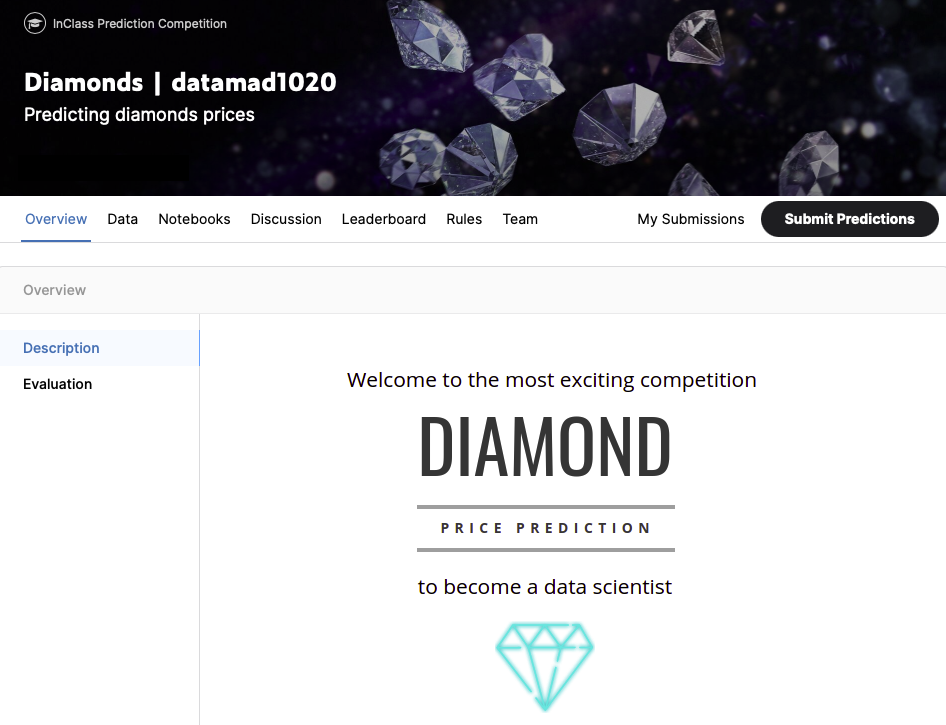

# Diamond price prediction (kaggle competition)
## Overview 
This project corresponds to the sixth project in the bootcamp at IronHack. Basically, we were asked to come up with a model to predict diamond prices.



The datasets given are listed below:
- ```predict.csv```, dataset (X) from which the prices must be predicted.
- ```train.csv```, dataset (X and y) from which the model should be trained.

The competition was over the weekend, from friday 4 to sunday 6 (december), and it was only aloow to summit 4 predictions (y_pred) per day.

## Development Process
In order to develop a pipeline and a model to meet the requirements of the competition, it was applied and follow some methods and steps that are presented below:

- Feature selection,
- Feature cross,
- Outliers detection,
- Rescaling,
- Regularization,
- Training the model,
- Diamond prices predictions, and
- Evaluation metrics.

It should be noted the project was mostly developed using ```sklearn``` paskage.